 

# SENSORED SINGLE PHASE BRUSHLESS DC MOTOR DRIVER USING dsPIC33CK

## <b>INTRODUCTION</b>

This document describes the setup requirements for running the Sensored Single Phase BLDC Motor Driver, which is referenced in the "Sensored Single Phase BLDC Motor Driver using dsPIC33CK” application note. .

### <b>Motor Control Application Firmware Required for the Demonstration</b>
- Sensored_SPBLDC_MCHV3_LVMC.X

### <b>Software Tools Used for Testing the firmware</b>

- MPLAB® X IDE v5.45 
- MPLAB® XC16 Compiler v1.70
- MPLAB® X IDE Plugin: X2C-Scope v1.3.3 

### <b> Hardware Tools Required for the Demonstration</b>

<table>
  <tr>
    <th>Development Board</th>
    <th>Power Supply</th>
    <th>Motor</th>
  </tr>
  <tr>
    <td>DSPICDEM™ MCHV3 Development Board (DM330023-3)</td>
    <td>10A 250V Power Adapter</td>
    <td>High Voltage (310V, 65W) Single Phase BLDC Motor</td>
  </tr>
  <tr>
    <td>dsPIC33CK Low Voltage Motor Control (LVMC) Development Board (DM330031)</td>
    <td>12V Power Supply</td>
    <td>Low Voltage (12V) Single Phase BLDC Motor</td>
  </tr>
  
</table>
   

## <b>HARDWARE SETUP</b>

This section describes hardware setup required for the demonstration.

> **_NOTE:_**
> Before making any connection on the MCHV-3 Board, verify that the system is not powered and it
is fully discharged. The system is completed discharged when the red
D13 LED is off.

1. 
 Connect the wires for Hall sensor and phase windings of the motor to the appropriate terminals of the development board, as mentioned in the table below.

<table>
  <tr>
    <th>Motor Wire</th>
    <th>LVMC Terminal</th>
    <th>MCHV3 Terminal</th>
  </tr>
  <tr>
    <td>Motor Pin A</td>
    <td>Phase A (J14)</td>
    <td>MOTOR PHASE 1 M1 (J17)</td>
  </tr>
  <tr>
    <td>Motor Pin B</td>
    <td>Phase B (J14)</td>
    <td>MOTOR PHASE 2 M2 (J17)</td>
  </tr>
  <tr>
    <td>Hall Supply (RED)</td>
    <td>3.3V (J7)</td>
    <td>5V (J9)</td>
  </tr>
  <tr>
    <td>Hall Ground (BLACK)</td>
    <td>GND (J7)</td>
    <td>GROUND (J9)</td>
  </tr>
  <tr>
    <td>Hall Signal (BLUE)</td>
    <td>HALL C (J7)</td>
    <td>HALL A(J9)</td>
  </tr>
</table>
<table>
  <tr>
    <th></th>
    <th>LVMC Terminal</th>
    <th>MCHV3 Terminal</th>
  </tr>
  <tr>
  <td>Motor Phases</td>
    <td>

     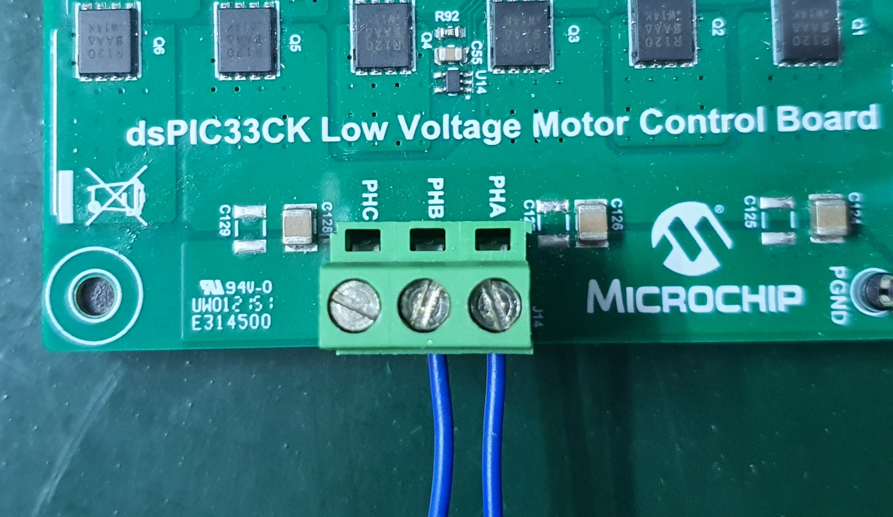
</td>
    <td>

     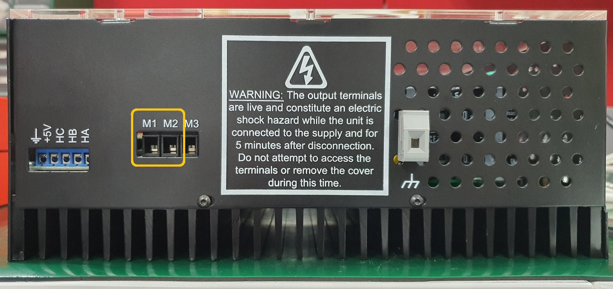
</td>
  </tr>
  <tr>
  <td>Hall Connectors</td>
    <td>

     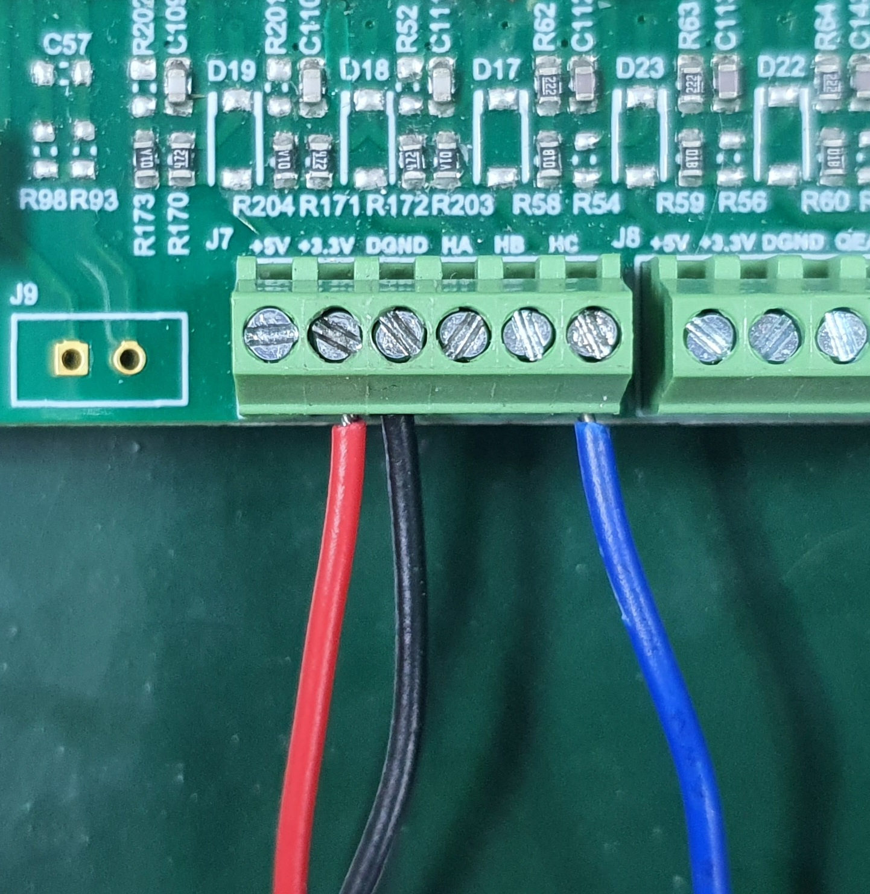
</td>
    <td>

     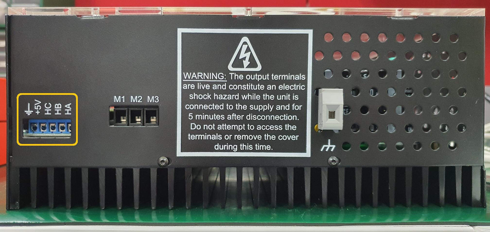
</td>
  </tr>
  </tr>
</table>

2. 
 On the MCHV-3 Development Board, connect a 90V-265V power supply to the J1 Terminal. On the LVMC Development Board, plug in the 12V (up to 48V) power supply to connector J1. The table below is provided to summarize the supply and terminal as well. 

<table>
  <tr>
    <th></th>
    <th>MCHV-3 </th>
    <th>LVMC </th>
  </tr>
  <tr>
    <td><b>Supply</b></td>
    <td>90V - 265V</td>
    <td>12V - 48V</td>
  </tr>
    <tr>
    <td><b>Terminal</b></td>
    <td>J1</td>
    <td>J1</td>
  </tr>
</table>

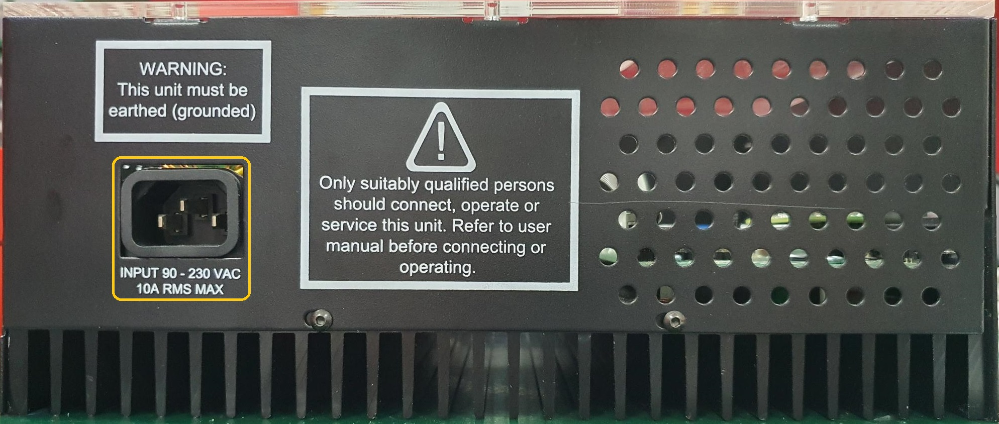

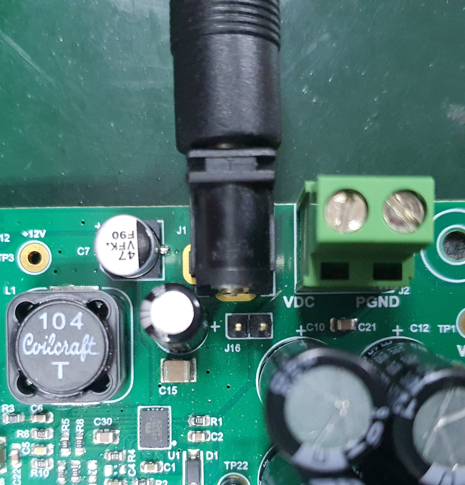

 

3.	
The onboard programmer ‘PICkit™ On Board (PKoB4)’ , is used for programming or debugging the dsPIC33CK256MP508. To use an on-board programmer, connect a micro-USB cable between Host PC and the terminal provided on the LVMC Board as indicated on the PKoB4 row in the table below. To enable communication using X2CScope between the board and the host PC, refer to USB row in the table below.

<table>
  <tr>
    <th> </th>
    <th>MCHV-3 </th>
    <th>LVMC </th>
  </tr>
  <tr>
    <td><b>PKoB4</b></td>
    <td>J19 (PROGRAM/DEBUG on the front panel)</td>
    <td>J13</td>
  </tr>
    <tr>
    <td><b>USB</b></td>
    <td>J6 (USB on the front panel)</td>
    <td>J6</td>
  </tr>
</table>

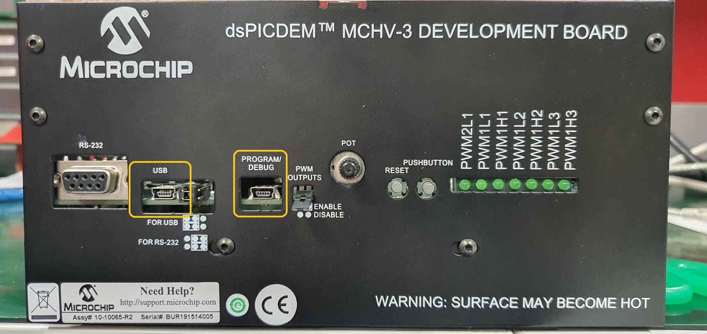

 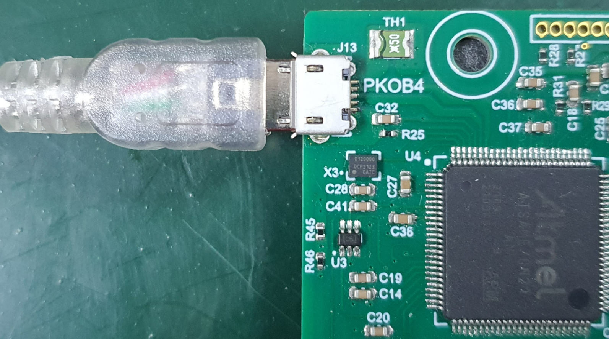

     
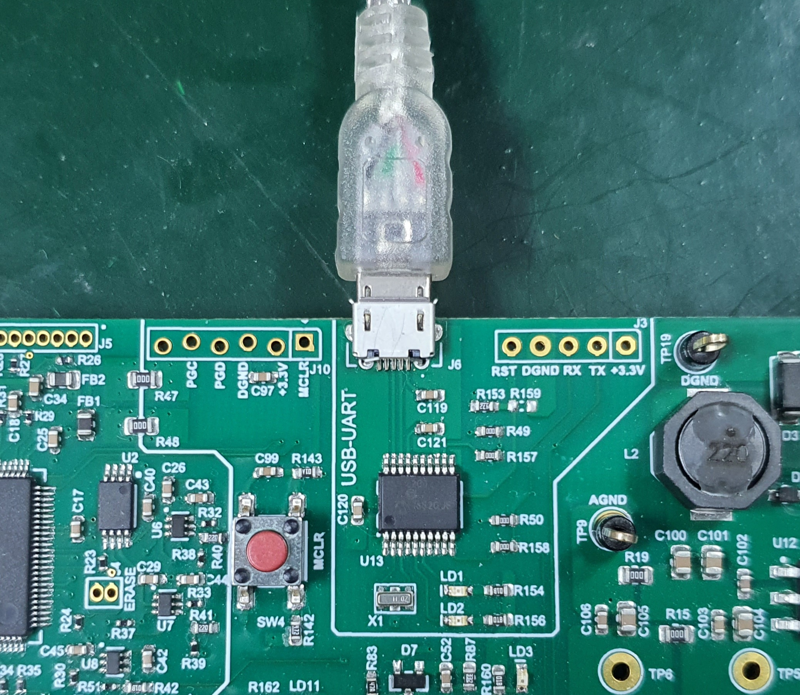

 
 

## <b>BASIC DEMONSTRATION</b>
### <b> Firmware Description</b>

This firmware is implemented to work on Microchip’s 16-bit Digital signal controller (dsPIC® DSC) dsPIC33CK256MP508. 
For more information, see the dsPIC33CK256MP508 Family datasheet (DS70005349).

The Motor Control Demo application uses push button to start or stop the motor and potentiometer to vary speed of the motor. This Motor Control Demo Application configures and uses peripherals like PWM, ADC, SCCP, UART etc.

For more details refer Microchip Application note ANXXXX 'Sensored Single Phase BLDC Motor driver' available at [Microchip web site](https://www.microchip.com/). 

> **_NOTE:_**
> The project may not build correctly in Windows OS if Maximum path length of any source file in the project is more than 260 characters. In case absolute path is exceeding or nearing maximum length, do any (or both) of the following:
> - Shorten the directory name containing the firmware used in this demonstration. If you renamed the directory, consider the new name while reading the instructions provided in the upcoming sections of the document.
> - Place firmware in a location, such that absolute path length of each file included in the projects does not exceed the Maximum Path length specified. 
Refer to MPLAB X IDE help topic <i>“Path, File, and Folder Name Restrictions”</i> for details.

### 5.2 Basic Demonstration

Follow below instructions step by step to setup and run the motor control demo application:

1. 
 Start MPLAB X IDE and open (File>Open Project) the project Sensored_SPBLDC_MCHV3_LVMC.X

    

       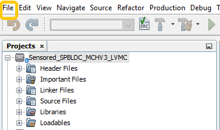

  

2. 
 Set the project Sensored_SPBLDC_MCHV3_LVMC.X as main project by right clicking on the project name and selecting 'Set as Main Project' as shown. The project <b>'Sensored_SPBLDC_MCHV3_LVMC'</b> will then appear in bold.

    

     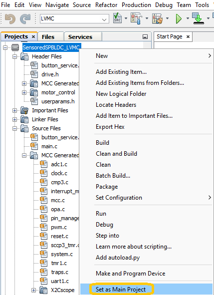

 

3. 
 On the configuration panel drop down menu, select if the development board used for demonstration is MCHV-3 or LVMC.

    

     

4. 
 Open userparams.h (under Sensored_SPBLDC_MCHV3_LVMC.X -> headerfiles) in the project Sensored_SPBLDC_MCHV3_LVMC.X 

     

- Ensure either CLOSEDLOOP  or OPENLOOP are defined in the LOOP CONTROLLER section.
- Select the default rotation of the motor based on the motor specification sheet by commenting either  CW or CCW.
- Uncomment the defined OVERTEMPERATURE_DETECTION, OVERCURRENT_DETECTION and/or STALL_DETECTION in the MOTOR FAULT DETECTION section to enable the motor fault detections. 
      

5. Right click on the project <i>Sensored_SPBLDC_MCHV3_LVMC.X</i> and select “Properties”  to open its Project Properties Dialog. Click the selected category “Conf: [MCHV3]" or "Conf: [LVMC]” to display the general project configuration information. In the category window: 

 - Select the specific Compiler Toolchain from the available list of compilers. Please ensure MPLAB® XC16 Compiler supports the device dsPIC33CK256MP508. In this case, “XC16(v1.70)” is selected.
      

 - Select the Hardware Tool to be used for programming and debugging. 
       
     
 -   After selecting Hardware Tool and Compiler Toolchain, click button <b>Apply</b>
        

        

6. 
 Ensure that the checkbox <b>'Load symbols when programming or building for production (slows process)'</b> is checked, which is under the 'Loading' category of the Project Properties window.
        
        
      

      

7. 
To build the project (in this case Sensored_SPBLDC_MCHV3_LVMC.X) and program the device dsPIC33CK256MP508, click <b>'Make and Program Device Main project'</b> on the toolbar.

    

    

8. 
 When the device is programmed successfully, run or stop the motor by pressing the push button. The appropriate LEDs should turn on and the motor should start spinning smoothly in one direction in the range indicated by the potentiometer. Ensure that the motor is spinning smoothly without any vibration.

<table>
  <tr>
    <th></th>
    <th>MCHV3 Terminal</th>
    <th>LVMC Terminal</th>
  </tr>
  <tr>
  <td>Push Button</td>
    <td>PUSH BUTTON - ON/OFF

     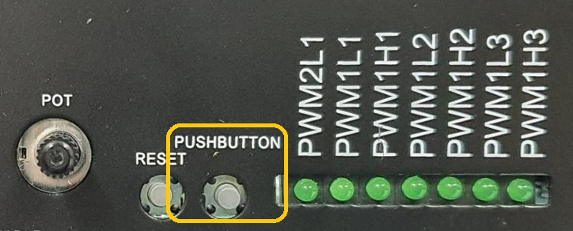
</td>
    <td>SW1 - ON/OFF  SW2 - REVERSE direction

     
</td>
  </tr>
</table>

9.  
 The motor speed can be varied using the potentiometer of the respective development board as indicated below.

    
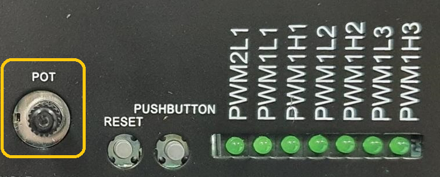

    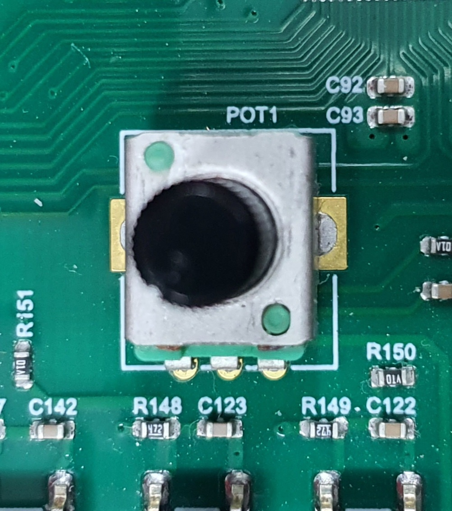

     

    

10. 
	Press the appropriate push button to stop the motor.

 
 ## <b>REFERENCES:</b>
For additional information, refer following documents or links.
1. Sensored Single Phase BLDC Motor Driver using dsPIC33CK Application Note
2. [dsPICDEM™ MCHV-3 Development Board User’s Guide](https://ww1.microchip.com/downloads/aemDocuments/documents/OTH/ProductDocuments/UserGuides/DS50002505a.pdf)
2. [dsPIC33CK Low-Voltage Motor Control board User's Guide](https://ww1.microchip.com/downloads/aemDocuments/documents/MCU16/ProductDocuments/UserGuides/DS50002927a.pdf)
3. [dsPIC33CK256MP508 Family Datasheet (DS70005349)](https://ww1.microchip.com/downloads/en/DeviceDoc/dsPIC33CK256MP508-Family-Data-Sheet-DS70005349H.pdf)

6. MPLAB® X IDE User’s Guide (DS50002027) or MPLAB® X IDE help
7. [MPLAB® X IDE installation](http://microchipdeveloper.com/mplabx:installation)
8. [MPLAB® XC16 Compiler installation](http://microchipdeveloper.com/xc16:installation)

