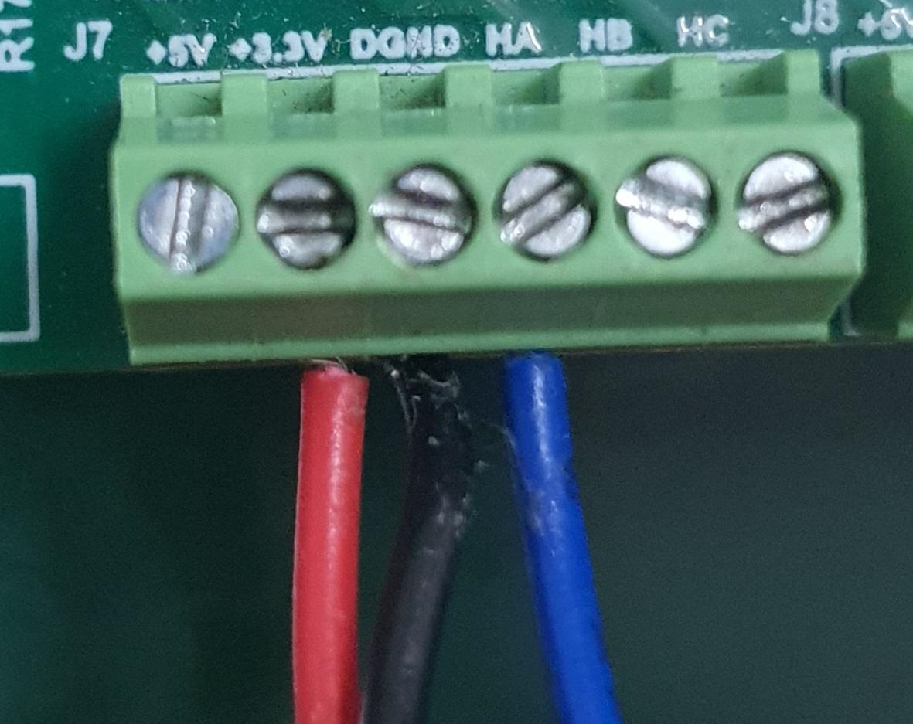
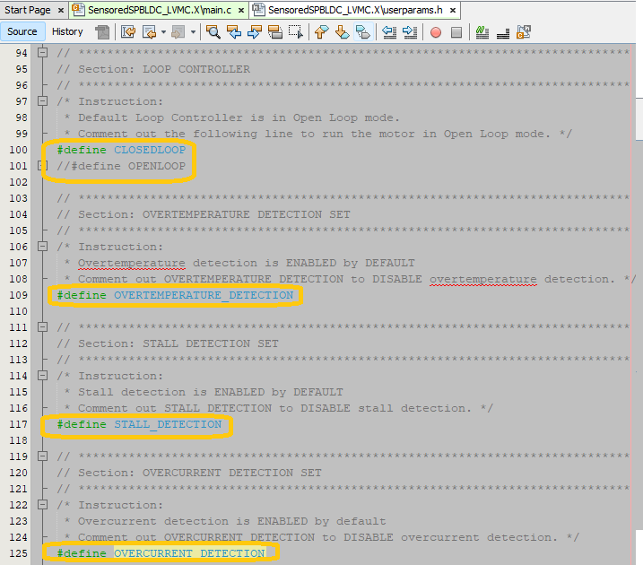
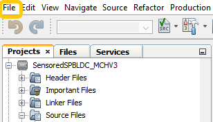
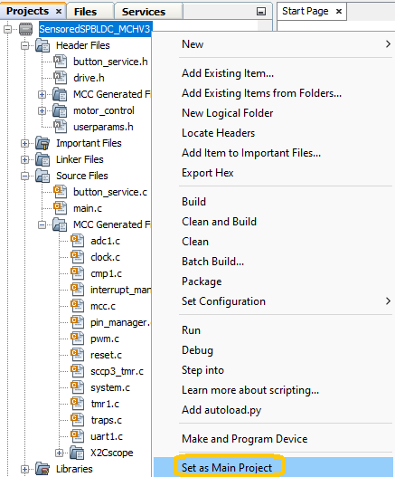
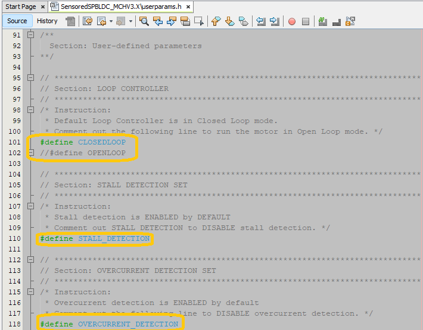
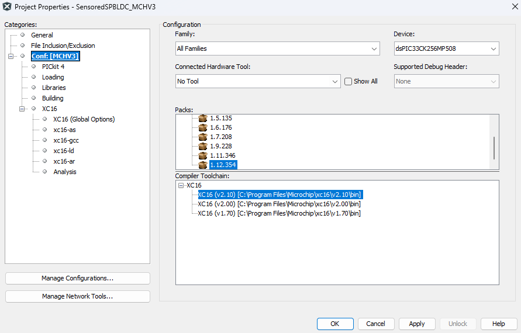
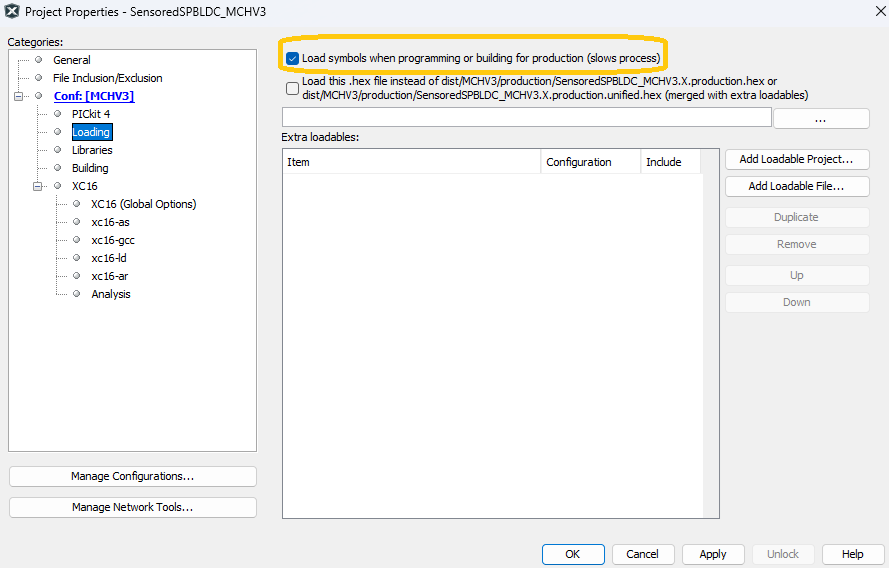

 

# **AN5423: Sensored Single Phase BLDC Motor Control using dsPIC33CK**

## <b>1. INTRODUCTION</b>

This document describes the hardware and software setup requirements and step-by-step instructions to do Sensored drive on the Single Phase Brushless DC (BLDC) Motor, as referenced in the AN5423.

## <b>2. TABLE OF CONTENTS</b>

&nbsp;1. Introduction 
&nbsp;2. Table of Contents 
&nbsp;3. Requirements 
&nbsp;4. Demonstration Set up for LVMC 
&nbsp;&nbsp;&nbsp;&nbsp;4.1. Hardware Set up for LVMC 
&nbsp;&nbsp;&nbsp;&nbsp;4.2. Software Set up for LVMC 
&nbsp;5. Demonstration Set up for MCHV3  
&nbsp;&nbsp;&nbsp;&nbsp;5.1. Hardware Set up for MCHV3 
&nbsp;&nbsp;&nbsp;&nbsp;5.2. Software Set up for MCHV3 
&nbsp;6. References 

## <b>3. REQUIREMENTS </b>
### <b>Motor Control Firmware </b>
<b>SensoredSPBLDC_LVMC.X or SensoredSPBLDC_MCHV3.X</b>  
> - Navigate MPLAB Discover page of AN5423 and download the ZIP file for firmware *Sensored_SPBLDC.X*
> - Navigate GitHub page of AN5423 and go to <> Code and download the ZIP file for firmware *Sensored_SPBLDC.X*

### <b>Software Tools Used for testing</b>

> - MPLAB® X IDE v6.15 
> - dsPIC33CK-MP_DFP v1.12.354
> - MPLAB® XC16 Compiler v2.10
> - MPLAB® X IDE Plugin X2Cscope v1.6.6 

### <b> Hardware Tools Required for the Demonstration</b>

> <table>
  <tr>
    <th>Development Board</th>
    <th>Power Supply</th>
  </tr>
  <tr>
    <td>DSPICDEM™ MCHV3 Development Board (DM3300233)</td>
    <td>250V AC</td>
  </tr>
    <tr>
    <td>dsPIC33CK Low Voltage Motor Control (LVMC) Development Board (DM330031)</td>
    <td>12V DC</td>
  </tr>
  
> </table>
   

## <b>3. DEMONSTRATION SET UP FOR LVMC </b>

### <b>3.1. HARDWARE SETUP FOR LVMC</b>

This section describes hardware setup required to drive the motor using <i>LVMC Development Board</i>.

1. 
 Connect the wires for the Hall Effect sensor and Phase windings of the motor to the appropriate terminals of the development board, as listed in the table below.

<table>
  <tr>
    <th>Motor Wire</th>
    <th>LVMC Board</th>
  </tr>
  <tr>
    <td>Motor Pin A</td>
    <td>Phase A (J14)</td>
  </tr>
  <tr>
    <td>Motor Pin B</td>
    <td>Phase B (J14)</td>
  </tr>
  <tr>
    <td>Hall Supply</td>
    <td>3.3V (J7)</td>
  </tr>
  <tr>
    <td>Hall Ground</td>
    <td>GND (J7)</td>
  </tr>
  <tr>
    <td>Hall Signal</td>
    <td>HALL A (J7)</td>
  </tr>
 </table>
   

<table>
  <tr>
    <th></th>
    <th>LVMC Board</th>
  </tr>
  <tr>
  <td>Motor Phases</td>
    <td>

     
</td>
  </tr>
  <tr>
  <td>Hall Connectors</td>
    <td>

     
</td>
  </tr>
  </tr>
</table>

2. 
 On the LVMC Development Board, plug in the 12V power supply to connector J1. Please see LVMC User's Guide for set-up using higher than 12V if desired.

<table>
  <tr>
    <th></th>
    <th>LVMC Board</th>
  </tr>
  <tr>
    <td><b>Supply</b></td>
    <td>12V DC</td>
  </tr>
    <tr>
    <td><b>Terminal</b></td>
    <td>J1</td>
  </tr>
</table>

3.	
The onboard programmer ‘PICkit™ On Board (PKoB4)’ , is used for programming or debugging the dsPIC33CK256MP508. To use the on-board programmer, connect a micro-USB cable between Host PC. To enable communication using X2CScope between the board and the host PC, refer to USB row in the table below.

<table>
  <tr>
    <th>Connection </th>
    <th>LVMC </th>
  </tr>
  <tr>
    <td><b>PKoB4 programmer</b></td>
    <td>J13</td>
  </tr>
    <tr>
    <td><b>UART-USB for X2CScope</b></td>
    <td>J6</td>
  </tr>
</table>

 

 
 

### <b>3.2. SOFTWARE SET UP FOR LVMC</b>

#### <b> Firmware Description</b>

This firmware is implemented on Microchip’s 16-bit Digital signal controller (dsPIC® DSC) dsPIC33CK256MP508. It uses peripherals such as the PWM, ADC, TIMER, CMP, UART etc. For more information, see the dsPIC33CK256MP508 Family datasheet (DS70005349).

This motor control demonstration uses the LVMC Development board user interface elements such as the push button (to start or stop the motor) and potentiometer (to vary speed of the motor). 

Follow below instructions step by step to setup and run the motor control demo application:

1. 
 Start MPLAB X IDE and open (File > Open Project) the project <b>SensoredSPBLDC_LVMC.X
</b>
    

       

  

2. 
 Set the project <b>SensoredSPBLDC_LVMC</b> as main project by right clicking on the project name and selecting 'Set as Main Project' in the drop down menu. The project <b>'SensoredSPBLDC_LVMC'</b> will then appear in boldface.

    

     

3. 
 Open userparams.h (under SensoredSPBLDC_LVMC > headerfiles) in the project SensoredSPBLDC_LVMC 

     

- Ensure either CLOSEDLOOP  or OPENLOOP are defined in the LOOP CONTROLLER section.
- Uncomment the defined OVERTEMPERATURE_DETECTION, OVERCURRENT_DETECTION and/or STALL_DETECTION in the MOTOR FAULT DETECTION section to enable the motor fault detections. 
      

4. Right click on the project SensoredSPBLDC_LVMC and select “Properties”  to open its Project Properties Dialog. In the category window: 

 - Select the dsPIC33CK DFP Pack and Compiler Toolchain from the available list of compilers. Please ensure MPLAB® XC16 Compiler supports the device dsPIC33CK256MP508. In this case, "v1.12.354" and “XC16(v2.10)” are selected.
      

 - Select the Hardware Tool to be used for programming and debugging. 
       
     
 -   After selecting Hardware Tool and Compiler Toolchain, click button <b>Apply</b>
        

        

5. 
 Ensure that the checkbox <b>'Load symbols when programming or building for production (slows process)'</b> is checked, which is under the 'Loading' category of the Project Properties window. This is used for X2Cscope. 
        
        
      

      

6. 
To build the project and program the device dsPIC33CK256MP508, click <b>'Make and Program Device Main project'</b> on the toolbar.

    

    

7. 
 When the device is programmed successfully, run or stop the motor by pressing the push button SW1. The LED LD11 and LD1O should turn on and the motor should start spinning in one direction in the speed range set by the potentiometer.

<table>
  <tr>
    <th></th>
    <th>LVMC Board</th>
  </tr>
  <tr>
  <td>Push Button</td>
    <td>SW1 - ON/OFF  SW2 - REVERSE direction

     
</td>
  </tr>
</table>

8.  
 The motor speed can be varied using the potentiometer POT1 of the LVMC board as shown below.

    
    

9. 
	Press SW2 to change the rotational direction of the motor. Motor runs CLOCKWISE by DEFAULT and this is indicated by LD11 in ON. Motor runs COUNTERCLOCKWISE when SW2 is pressed and the LD11 is OFF. Press the SW1 push button again to stop the motor. LD10 indicates ON or OFF state of drive. 

 

## <b>4. DEMONSTRATION SETUP FOR MCHV3</b>
### <b> 4.1 HARDWARE SET UP FOR MCHV3 </b>

This section describes hardware setup required to drive the motor using <i>MCHV3 Development Board</i>.

> **_NOTE:_**
> Before making any connection on the MCHV3 Board, verify that the system is not powered and it
is fully discharged. The system is completed discharged when the red
D13 LED is off.

1. 
 Connect the wires for Hall Effect sensor and phase windings of the motor to the appropriate terminals of the development board, as listed in the table below.

<table>
  <tr>
    <th>Motor Wire</th>
    <th>MCHV3 Board</th>
  </tr>
  <tr>
    <td>Motor Pin A</td>
    <td>M1 (J17)</td>
  </tr>
  <tr>
    <td>Motor Pin B</td>
    <td>M2 (J17)</td>
  </tr>
  <tr>
    <td>Hall Supply</td>
    <td>5V (J9)</td>
  </tr>
  <tr>
    <td>Hall Ground</td>
    <td>GROUND (J9)</td>
  </tr>
  <tr>
    <td>Hall Signal</td>
    <td>HALL A(J9)</td>
  </tr>
</table>

<table>
  <tr>
    <th></th>
    <th>MCHV3 Board</th>
  </tr>
  <tr>
  <td>Motor Phases</td>
    <td>

     
</td>
  </tr>
  <tr>
  <td>Hall Connectors</td>
    <td>

     
</td>
  </tr>
  </tr>
</table>

2. 
 On the MCHV3 Development Board, use the appropriate AC supply voltage (e.g. 250V AC source) and connect a power adapter to the input socket (J1 Terminal on the board). The table below is provided to summarize the supply and terminal as well. 

<table>
  <tr>
    <th></th>
    <th>MCHV3 Board</th>
  </tr>
  <tr>
    <td><b>Supply</b></td>
    <td>250V</td>
  </tr>
    <tr>
    <td><b>Terminal</b></td>
    <td>J1</td>
  </tr>
</table>

 
3.	
The onboard programmer ‘PICkit™ On Board (PKoB4)’, is used for programming or debugging the dsPIC33CK DSC. As shown in the picture of the MCHV3 front panel, use the programmer/debug USB interface to program the board. Use the Connect a connector J13. To enable communication using X2CScope, use a similar cable and connect to J6

<table>
  <tr>
    <th> Connection </th>
    <th>LVMC </th>
  </tr>
  <tr>
    <td><b>PKoB4</b></td>
    <td>J19 (PROGRAM/DEBUG on the front panel)</td>
    <td>J13</td>
  </tr>
    <tr>
    <td><b>USB</b></td>
    <td>J6 (USB on the front panel)</td>
    <td>J6</td>
  </tr>
</table>

 
 

### <b>4.2 SOFTWARE SET UP FOR MCHV3</b>
#### <b> Firmware Description</b>

This firmware is implemented on Microchip’s 16-bit Digital signal controller (dsPIC® DSC) dsPIC33CK256MP508. 
For more information, see the dsPIC33CK256MP508 Family datasheet (DS70005349).

The Motor Control Demo application uses push button to start or stop the motor and potentiometer to vary speed of the motor. This Motor Control Demo Application configures and uses peripherals like PWM, ADC, SCCP, UART etc.

### Basic Demonstration

Follow below instructions step by step to setup and run the motor control demo application:

1. 
 Start MPLAB X IDE and open (File>Open Project) the project SensoredSPBLDC_MCHV3.X

    

       

  

2. 
 Set the project SensoredSPBLDC_MCHV3.X as main project by right clicking on the project name and selecting 'Set as Main Project' as shown. The project <b>'SensoredSPBLDC_MCHV3'</b> will then appear in bold.

    

     

3. 
 Open userparams.h (under SensoredSPBLDC_MCHV3.X -> headerfiles) in the project SensoredSPBLDC_MCHV3.X 

     

- Ensure either CLOSEDLOOP  or OPENLOOP are defined in the LOOP CONTROLLER section.
- Uncomment the defined OVERCURRENT_DETECTION and/or STALL_DETECTION in the MOTOR FAULT DETECTION section to enable the motor fault detections. 
      

4. Right click on the project SensoredSPBLDC_MCHV3.X. In the category window: 

- Select the dsPIC33CK DFP Pack and Compiler Toolchain from the available list of compilers. Please ensure MPLAB® XC16 Compiler supports the device dsPIC33CK256MP508. In this case, "v1.12.354" and “XC16(v2.10)” are selected.
      

 - Select the Hardware Tool to be used for programming and debugging. 
       
     
 -   After selecting Hardware Tool and Compiler Toolchain, click button <b>Apply</b>
        

        

5. 
 Ensure that the checkbox <b>'Load symbols when programming or building for production (slows process)'</b> is checked, which is under the 'Loading' category of the Project Properties window.
        
        
      

      

6. 
To build the project (in this case Sensored_SPBLDC_MCHV3_LVMC.X) and program the device dsPIC33CK256MP508, click <b>'Make and Program Device Main project'</b> on the toolbar.

    

    

7. 
 When the device is programmed successfully, run or stop the motor by pressing the push button. The appropriate LEDs should turn on and the motor should start spinning smoothly in one direction in the range indicated by the potentiometer. Ensure that the motor is spinning smoothly without any vibration.

<table>
  <tr>
    <th></th>
    <th>MCHV3 Board</th>
  </tr>
  <tr>
  <td>Push Button</td>
    <td>PUSH BUTTON - ON/OFF

     
</td>
  </tr>
</table>

8.  
 The motor speed can be varied using the potentiometer of the respective development board as indicated below.

    

    
9. 
	Press the appropriate push button to stop the motor.

 
 ## <b>6. REFERENCES</b>
For additional information, refer to the following documents or links.
1. AN5423 Application Note "Sensored Single Phase BLDC Motor Driver using dsPIC33CK"
2. [dsPICDEM™ MCHV3 Development Board User’s Guide](https://ww1.microchip.com/downloads/aemDocuments/documents/OTH/ProductDocuments/UserGuides/DS50002505a.pdf)
2. [dsPIC33CK Low-Voltage Motor Control board User's Guide](https://ww1.microchip.com/downloads/aemDocuments/documents/MCU16/ProductDocuments/UserGuides/DS50002927a.pdf)
3. [dsPIC33CK256MP508 Family Datasheet (DS70005349)](https://ww1.microchip.com/downloads/en/DeviceDoc/dsPIC33CK256MP508-Family-Data-Sheet-DS70005349H.pdf)

6. MPLAB® X IDE User’s Guide (DS50002027) or MPLAB® X IDE help
7. [MPLAB® X IDE installation](http://microchipdeveloper.com/mplabx:installation)
8. [MPLAB® XC16 Compiler installation](http://microchipdeveloper.com/xc16:installation)

