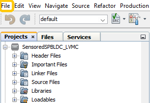
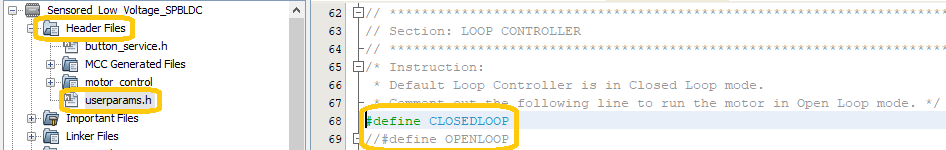
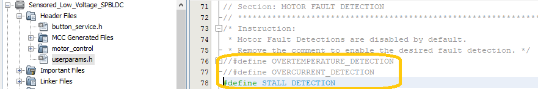
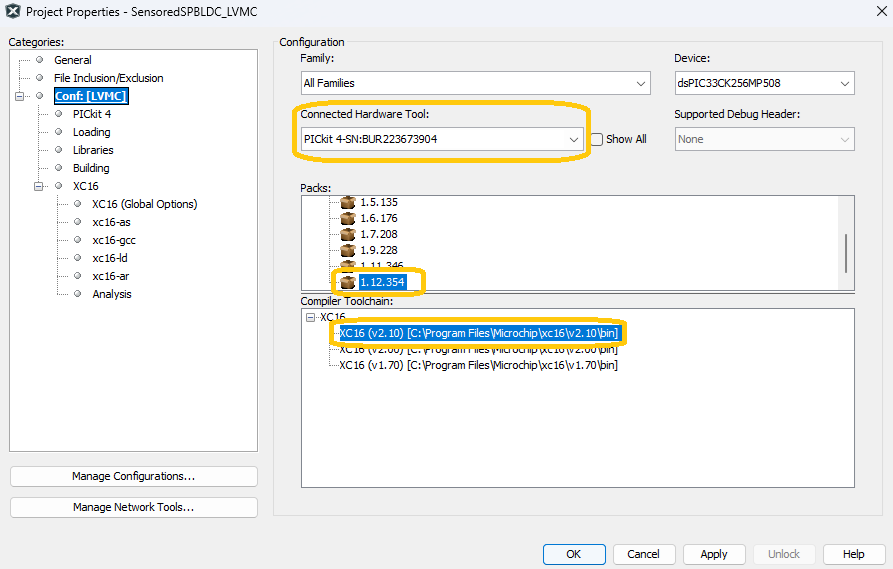
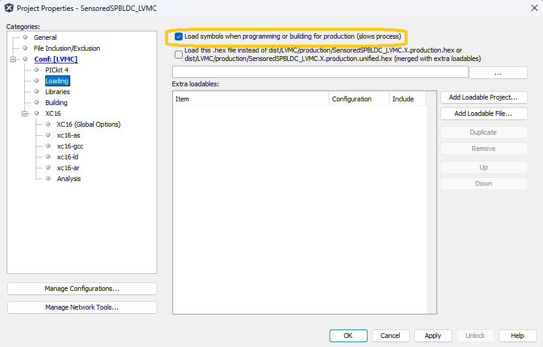

 

## SENSORED SINGLE PHASE BRUSHLESS DC MOTOR DRIVER USING dsPIC33CK (LOW VOLTAGE FAN MOTOR ON LVMC BOARD)

## 1. INTRODUCTION

This document describes the setup requirements for running the Low Voltage, Sensored, Single Phase BLDC Motor Driver, which is referenced in ANXXXX “Sensored Single Phase BLDC Motor Driver using dsPIC33CK” using a dsPIC33CK Low Voltage Motor Control (LVMC) Development Board (DM330031).

## 2.	SUGGESTED DEMONSTRATION REQUIREMENTS

### 2.1 Motor Control Application Firmware Required for the Demonstration
To clone or download this application from Github, go to the [main page of this repository](https://bitbucket.microchip.com/projects/MCU16CE/repos/lvmc-dspic33ck-an2049-sensored-single-phase-bldc-motor-driver/browse) and then click Clone button to clone this repository or download as zip file.
> **_NOTE:_**
>In this document, hereinafter this firmware package is referred as firmware.
### 2.2 Software Tools Used for Testing the firmware

- MPLAB® X IDE v5.45 
- MPLAB® XC16 Compiler v1.70
- MPLAB® X IDE Plugin: X2C-Scope v1.3.3 
- DFP: dsPIC33CK-MP_DFP v1.6.176
> **_NOTE:_**
>The software used for testing the firmware prior to release is listed above. It is recommended to use the version listed above or later versions for building the firmware.
### 2.3 Hardware Tools Required for the Demonstration
- dsPIC33CK Low Voltage Motor Control (LVMC) Development Board (DM330031)
- 12V Power Supply
- 12V Single Phase Brushless DC Fan Motor 
   

## 3. HARDWARE SETUP

This section describes hardware setup required for the demonstration.

1. 
 Connect the wires for Hall sensor and phase windings of the motor to the appropriate terminals of the development board, as mentioned in the table below.

<table>
  <tr>
    <th>Motor Wire</th>
    <th>LVMC Terminal</th>
    <th>MCHV3 Terminal</th>
  </tr>
  <tr>
    <td>Motor Pin A</td>
    <td>Phase A (J14)</td>
    <td>MOTOR PHASE 1 M1 (J17)</td>
  </tr>
  <tr>
    <td>Motor Pin B</td>
    <td>Phase B (J14)</td>
    <td>MOTOR PHASE 2 M2 (J17)</td>
  </tr>
  <tr>
    <td>Hall Supply (RED)</td>
    <td>3.3V (J7)</td>
    <td>5V (J9)</td>
  </tr>
  <tr>
    <td>Hall Ground (BLACK)</td>
    <td>GND (J7)</td>
    <td>GROUND (J9)</td>
  </tr>
  <tr>
    <td>Hall Signal (BLUE)</td>
    <td>HALL C (J7)</td>
    <td>HALL A(J9)</td>
  </tr>
</table>
     

     

     

     

2. 
 On the MCHV-3 Development Board, connect a 90V-265V power supply to the J1 Terminal. On the LVMC Development Board, plug in the 12V (up to 48V) power supply to connector J1. The table below is provided to summarize the supply and terminal as well. 

<table>
  <tr>
    <th></th>
    <th>MCHV-3 </th>
    <th>LVMC </th>
  </tr>
  <tr>
    <td><b>Supply</b></td>
    <td>90V - 265V</td>
    <td>12V - 48V</td>
  </tr>
    <tr>
    <td><b>Terminal</b></td>
    <td>J1</td>
    <td>J1</td>
  </tr>
</table>

 

3.	
The LVMC board has an onboard programmer ‘PICkit™ On Board (PKoB4)’ , which can be used for programming or debugging the dsPIC33CK256MP508. To use an on-board programmer, connect a micro-USB cable between Host PC and Connector J13 provided on the LVMC Board. To enable communication using X2CScope between the board and the host PC, connect a micro-USB cable to J6.

 

The MCHV-3 Development Board uses ‘PICkit™ On Board (PKoB4)’ also. Connect a micro-USB cable between Host PC and Connector J20. To enable communication using X2CScope between the board and the host PC, connect a micro-USB cable to J6.

     

     

     

 
 

## 4. SOFTWARE SETUP AND RUN
### 4.1 Setup: MPLAB X IDE and MPLAB XC16 Compiler

Install MPLAB X IDE and MPLAB XC16 Compiler versions that support the device dsPIC33CK256MP508 and PKoBv4. The MPLAB X IDE, MPLAB XC16 Compiler, and X2C-Scope plug-in used for testing the firmware are mentioned in the [Motor Control Application Firmware Required for the Demonstration](#21-motor-control-application-firmware-required-for-the-demonstration) section. To get help on  

- MPLAB X IDE installation, refer [link](https://microchipdeveloper.com/mplabx:installation)
- MPLAB XC16 Compiler installation steps, refer [link](https://microchipdeveloper.com/xc16:installation)

If MPLAB IDE v8 or earlier is already installed on your computer, then run the MPLAB driver switcher (It is installed when MPLAB®X IDE is installed) to switch from MPLAB IDE v8 drivers to MPLAB X IDE drivers. If you have Windows 7 or 8, you must run MPLAB driver switcher in ‘Administrator Mode’. To run the Device Driver Switcher GUI application as administrator, right click on the executable (or desktop icon) and select ‘Run as Administrator’. For additional details refer MPLAB X IDE help topic <i>“Before You Begin: Install the USB Device Drivers (For Hardware Tools): USB Driver Installation for Windows Operating Systems”</i>. 

### 4.2  X2C-Scope

X2C-Scope is a MPLAB X IDE plugin that allows a developer to interact with an application while the application program is running. X2C-Scope enables you to read, write, and plot global variables (for motor control) in real time. It communicates with the target using the UART. To use X2C-Scope, the plugin must be installed:

- In MPLAB X IDE, select <i>Tools>Plugins</i> and click on the Available Plugins tab.
- Select X2C-Scope plug-in by checking its check box, and then click Install.
- Look for tool X2C-Scope under <i>Tools>Embedded.</i>

  

 
 

## 5.  BASIC DEMONSTRATION
### 5.1 Firmware Description

The firmware version needed for the demonstration is mentioned under the [Motor Control Application Firmware Required for the Demonstration](#21-motor-control-application-firmware-required-for-the-demonstration) section.

This firmware is implemented to work on Microchip’s 16-bit Digital signal controller (dsPIC® DSC) dsPIC33CK256MP508. 
For more information, see the dsPIC33CK256MP508 Family datasheet (DS70005349).

The Motor Control Demo application uses push button to start or stop the motor and potentiometer to vary speed of the motor. This Motor Control Demo Application configures and uses peripherals like PWM, ADC, SCCP, UART etc.

For more details refer Microchip Application note ANXXXX 'Sensored Single Phase BLDC Motor driver' available at [Microchip web site](https://www.microchip.com/). 

> **_NOTE:_**
> The project may not build correctly in Windows OS if Maximum path length of any source file in the project is more than 260 characters. In case absolute path is exceeding or nearing maximum length, do any (or both) of the following:
> - Shorten the directory name containing the firmware used in this demonstration. If you renamed the directory, consider the new name while reading the instructions provided in the upcoming sections of the document.
> - Place firmware in a location, such that absolute path length of each file included in the projects does not exceed the Maximum Path length specified. 
Refer to MPLAB X IDE help topic <i>“Path, File, and Folder Name Restrictions”</i> for details.

### 5.2 Basic Demonstration

Follow below instructions step by step to setup and run the motor control demo application:

1. 
 Start MPLAB X IDE and open (File>Open Project) the project Sensored_SPBLDC_MCHV3_LVMC.X with device selection dsPIC33CK256MP508.

    

       

  

2. 
 Set the project Sensored_SPBLDC_MCHV3_LVMC.X as main project by right clicking on the project name and selecting 'Set as Main Project' as shown. The project <b>'Sensored_SPBLDC_MCHV3_LVMC'</b> will then appear in bold.

    

     

 

	
3. 
 Open userparams.h (under Sensored_SPBLDC_MCHV3_LVMC.X -> headerfiles) in the project Sensored_SPBLDC_MCHV3_LVMC.X 

     

- Ensure either CLOSEDLOOP  or OPENLOOP are defined in the LOOP CONTROLLER section.
      

- Uncomment the defined OVERTEMPERATURE_DETECTION, OVERCURRENT_DETECTION and/or STALL_DETECTION in the MOTOR FAULT DETECTION section to enable the motor fault detections. 
      

      

4. Right click on the project <i>Sensored_SPBLDC_MCHV3_LVMC.X</i> and select “Properties”  to open its Project Properties Dialog. Click the “Conf: [LVMC]” category to reveal the general project configuration information. The development tools used for testing the firmware are listed in the section [2.2 Software Tools Used for Testing the firmware](#22-software-tools-used-for-testing-the-firmware).
   

    In the <b><i>‘Conf: [LVMC]’</i></b> category window: 
    

 - Select the specific Compiler Toolchain from the available list of compilers. Please ensure MPLAB® XC16 Compiler supports the device dsPIC33CK256MP508. In this case, “XC16(v1.70)” is selected.
      

 - Select the Hardware Tool to be used for programming and debugging. 
       
     
 -   After selecting Hardware Tool and Compiler Toolchain, click button <b>Apply</b>
        

        

5. 
 Ensure that the checkbox <b>'Load symbols when programming or building for production (slows process)'</b> is checked, which is under the 'Loading' category of the Project Properties window.
        
        
      

      

6. 
To build the project (in this case Sensored_SPBLDC_MCHV3_LVMC.X) and program the device dsPIC33CK256MP508, click <b>'Make and Program Device Main project'</b> on the toolbar.

    

    

7. 
 When the device is programmed successfully, run or stop the motor by pressing the push button <b>SW1</b>. LD10 (LED1) should turn on and the motor should start spinning smoothly in one direction in the range indicated by the potentiometer. Ensure that the motor is spinning smoothly without any vibration.

     

     

 

8.  
 The motor speed can be varied using the potentiometer (labeled <b>'POT1'</b>).

    

    

9.  
 The direction of the motor rotation can be changed to reverse by pressing the push button <b>SW1</b>.

10. 
	Press the push button <b>SW1</b> to stop the motor.

## 5.3  Data visualization through X2C-Scope Plug-in of MPLABX

 X2C-Scope is a third-party plug-in for MPLAB X, which helps in real-time diagnostics. The application firmware comes with the initialization needed to interface controller with the host PC to enable data visualization through X2C-Scope plug-in.

1. Ensure X2C-Scope Plug-in is installed. For additional information on how to set up a plug-in refer [https://microchipdeveloper.com/mplabx:tools-plugins-available](https://microchipdeveloper.com/mplabx:tools-plugins-available)
 
2.	To establish serial communication with the host PC, connect a micro-USB cable between the host PC and the LVMC Board (connector J6).

3. Ensure application is configured and running as described under Section [Basic Demonstration](#5-basic-demonstration   ) by following steps 1 through 11.

 

4. Open the X2C-Scope window by selecting Tools>Embedded>X2CScope.

      

       

 

5. Open the X2C-Scope Configuration window and in <b>'Select project'</b> menu, select <b>Sensored_SPBLDC_MCHV3_LVMC</b> project as shown.
    

    

6.	Serial communication needs to be set up, as shown in the following figure. Ensure the communication baud rate is set to 115200 as configured in the application firmware. The COM port used depends on the system settings. The refresh button lists the available COM Ports. Select the COM Port as per the connection.

    

     

 

7. Once the COM port is detected, click on <b>'Disconnected'</b> and turn to <b>'Connected'</b>, to establish a serial communication between Host PC and the board.
     

    

8. Set the <b>'Project Setup'</b> as shown below and click <b>'Set Value'</b>. Set Scope sample time as interval at which X2CScopeUpdate() is called. In this application it is every 50µs.
      

      

9. When the setup is established, click on open scope View (under sub window <b>'Data Views'</b>), this opens 'Scope Window'.
     

      

    	     

10. In this window, select the variables that needs to be monitored. To do this, click on the source against each channel, a window Select Variables opens upon the screen. From the available list, the required variable can be chosen. Ensure check boxes Enable & Visible are checked for the variables to be plotted. 
To view data plots continuously, uncheck Single-shot. When Single-shot is checked it captures the data once and stops. The Sample time factor value multiplied with Sample time determines the time difference between any two consecutive data points on the plot.
    

    

11.	Click on <b>'SAMPLE'</b>, then X2C-Scope window shows variables in real time, which is updated automatically.
     

     

 

12.	Click on <b>'ABORT'</b> to stop.
     

     

 
 ## 6. REFERENCES:
For additional information, refer following documents or links.
1. ANXXXX Application Note [Sensored Single Phase BLDC Motor Driver using dsPIC33CK] (soon)
2. [dsPIC33CK Low-Voltage Motor Control board User's Guide](https://ww1.microchip.com/downloads/aemDocuments/documents/MCU16/ProductDocuments/UserGuides/DS50002927a.pdf)
3. [dsPIC33CK256MP508 Family Datasheet (DS70005349)](https://ww1.microchip.com/downloads/en/DeviceDoc/dsPIC33CK256MP508-Family-Data-Sheet-DS70005349H.pdf)

6. MPLAB® X IDE User’s Guide (DS50002027) or MPLAB® X IDE help
7. [MPLAB® X IDE installation](http://microchipdeveloper.com/mplabx:installation)
8. [MPLAB® XC16 Compiler installation](http://microchipdeveloper.com/xc16:installation)

